## 1. バージョン管理システム(VCS)とは
複数人でプログラムを共同開発する際にGoogle Driveなどの通常のクラウドストレージを利用するとさまざまな問題が発生する。例えば、以下のケースが想定される。
1. 複数メンバーが同時に同じファイルを編集した場合、最後に保存したメンバーの変更しか反映されず、他のメンバーの変更が失われてしまう。
2. 誰が・どこを・いつ変更したのかが分からず、バグが発生した際に原因を特定するのが困難。
3. 過去の状態に戻したいと思ったとき、単純にファイルのコピーを保存していく形では、どのファイルがどの時点のものなのか判別できなくなり、管理が煩雑になる。

このような課題を解決するのがバージョン管理システム(VCS)である。VCSはプログラムの変更履歴と変更を加えた人物、変更日時を記録するシステムである。以降のセクションではVCSの代表例であるGitと、そのホスティングサービスであるGitHubについて説明する。

## 2. GitのインストールとGitHubの登録

### 2.1 Gitのインストール

* **Windows**: [Git for Windows](https://gitforwindows.org/) からダウンロードしインストールします。
* **macOS**: ターミナルで `git --version` を実行し、画面の指示に従うかHomebrew (`brew install git`) を使用します。

### 2.2 GitHubの登録
* **GitHub**: [GitHub公式サイト](https://github.com/) からアカウントを作成（Sign up）します。

### 2.3 VS CodeでのGitHubログイン手順
まず、既にログイン済みかどうかを左下の人型アイコンをクリックして確認します。すでにログイン済みだった場合、この章は飛ばしても問題ありません。

- ログインしていない場合

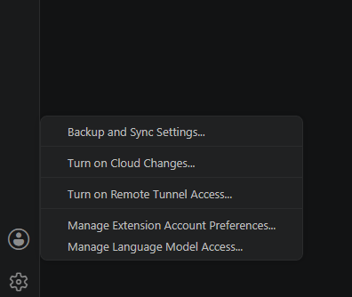

- ログイン済みの場合、<アカウント名> (GitHub)という表示が出る

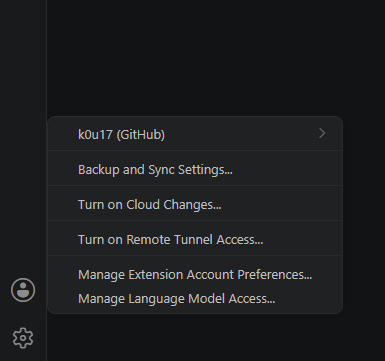

ログインしていない場合は上にあるSign Inボタンをクリックします。

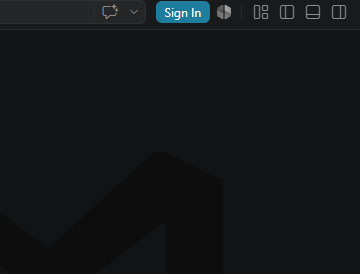

すると、ログインしてAI機能を使うといった内容のダイアログが出ますが、ここからGitHubにログインすることで、VS Code上でAI機能以外の場面でもGitHubアカウントが使えるようになります。

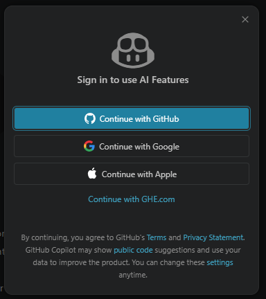

### 2.4 Gitの初期設定

Gitでコミットを行うには、誰がコミットしたかを記録するための「ユーザー名」と「メールアドレス」の初期設定が必要です。

1. **noreplyアドレスの取得（任意）**
   プライバシーを守りたい場合は、GitHubが提供する**ダミーのメールアドレス（noreplyアドレス）**を設定しましょう。
   GitHubの右上のアイコンから「**Settings**」> 左側メニューの「**Emails**」を開きます。
   設定画面の中に `ID+username@users.noreply.github.com` という形式のアドレスが記載されているので、次のステップでメールアドレスとして使います。（例: `199738600+k0u17@users.noreply.github.com`）
   
   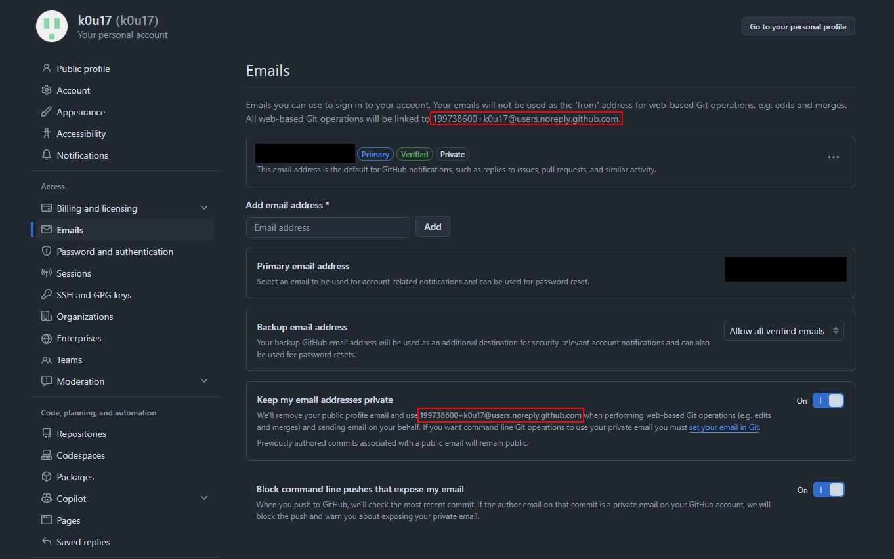

2. **ターミナルで初期設定コマンドを実行**
   VS Codeのターミナルを開き、以下のコマンドを1行ずつ実行します。（名前とアドレスは自分のものに置き換えてください）
   ```bash
   git config --global user.name "あなたのGitHubユーザー名"
   git config --global user.email "あなたのメールアドレス"
   ```
   
   これで、コミットを行う準備が整いました。

### 2.3 SSHキーのセットアップ（安全な通信）

ローカルのPCからGitHubへ安全にプッシュ・プルを行うために、**SSH（Secure Shell）**という暗号化通信の仕組みを設定します。
SSHを設定しておくと、毎回パスワードやトークンを入力する手間が省け、よりセキュアに操作できます。

設定の具体的な手順については、お使いのOS（Windows/Mac）に合わせて以下のGitHub公式ドキュメントを参照し、セットアップを完了させてください。

> **Windowsユーザーの方へ**: 公式ドキュメントのWindows向け手順は、「**Git Bash**」というUnix風のターミナルを使用することが前提となっています。VS Codeのデフォルトである「PowerShell」ではエラーになるコマンドが含まれているため、操作の際はスタートメニュー等から「Git Bash」を開いて実行してください。（※Git Bashは、Git本体をインストールした際に自動的に一緒に入っているため、別途インストールする必要はありません）

* [新しい SSH キーを生成して ssh-agent に追加する](https://docs.github.com/ja/authentication/connecting-to-github-with-ssh/generating-a-new-ssh-key-and-adding-it-to-the-ssh-agent)
* [GitHub アカウントへの新しい SSH キーの追加](https://docs.github.com/ja/authentication/connecting-to-github-with-ssh/adding-a-new-ssh-key-to-your-github-account)

設定が完了すると、GitHubのURLに `git@github.com:...` を使って安全に通信できるようになります！
## 3. Gitに登場する概念

GitやGitHubを使う上で、以下の基本的な概念を理解しておくことが重要です。

* **ローカル (Local)**: あなたが今作業している手元のPC環境のことです。
* **リモート (Remote)**: ネットワーク上（今回はGitHub）にある共有環境のことです。チームメンバーとコードをやり取りするための「ハブ（拠点）」の役割を果たします。
* **リポジトリ (Repository)**: ファイルやフォルダの変更履歴を保存する場所。手元のPCにあるものを「ローカルリポジトリ」、GitHub上にあるものを「リモートリポジトリ」と呼びます。
* **コミット (Commit)**: ファイルの追加や変更を履歴に記録する操作。変更の節目ごとにメッセージをつけて保存します。
* **ブランチ (Branch)**: 履歴の流れを分岐させて並行して開発を行うための仕組み。基本となるブランチ（通常は `main`）から分岐させ、作業が終わったら再び統合（マージ）します。
* **origin**: Gitにおいて、デフォルトで設定される「リモートリポジトリ（GitHubなど）」のエイリアスです。コマンドによって書き方が変わる点に注意が必要です。
  * **スペース**で区切る場合（例: `git push origin main`）：「`origin`（宛先）へ、私の `main` ブランチ（対象）を送信する」というように、2つの引数として渡しています。
  * **スラッシュ**で繋ぐ場合（例: `git merge origin/main`）：手元のPCに保存されている「最後にGitHubと通信した時点の `main` ブランチのコピー」という1つの実体（ブランチ名）を指します。これを正式には **リモート追跡ブランチ (Remote-tracking branch)** と呼びます。
* **フェッチ（Fetch）**: GitHub（リモート）にある最新の変更履歴をダウンロードし、手元のPCにある「リモート追跡ブランチ（GitHubの分身）」だけを最新化する操作です。この時点では作業ファイルは書き換わりません。
* **HEAD**: 現在自分が作業している「最新のコミット」を指し示すポインタ（目印）です。「今自分が履歴上のどこを見ているか」を表します。

### ブランチとマージのイメージ

以下の図は、「新デザイン（`feature/new-design`）の開発中でコードが一時的に動かない状態のときに、本番環境で緊急のバグが発生し、その修正（`hotfix/login-bug`）を行う」というシチュエーションです。
ブランチを分けているおかげで、開発途中の壊れたコードが混入することなく、安全に緊急バグの修正を行って `main` に反映させることができます。

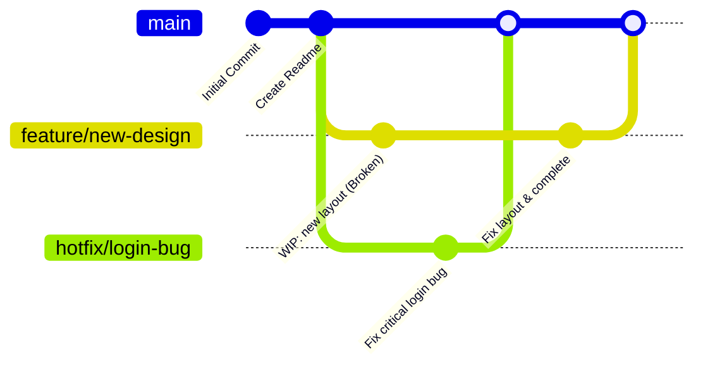

### MergeとRebase

枝分かれしたブランチを1つにまとめる代表的な手法には「**マージ（Merge）**」のほかに「**リベース（Rebase）**」があります。

#### 1. マージ（Merge）
枝分かれした履歴をそのまま残し、合流点として新しく「マージコミット」を作成して統合します。実際の作業履歴が正確に残りますが、複数人で頻繁にマージを行うと履歴（グラフ）が複雑な網の目状になりやすいです。

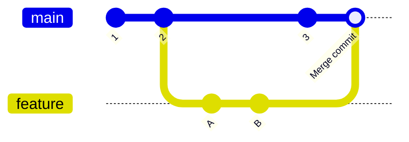

#### 2. リベース（Rebase）
ブランチの枝分かれした「根元（ベース）」を、別のブランチの最新コミットに付け替える（つなぎ直す）操作です。まるで最初から最新の状態を元に開発していたかのように履歴が一直線に整うため、後から見たときに変更履歴が追いやすくなります。

**【リベース前】**
（`feature` ブランチはコミット `2` から分岐して作られています）
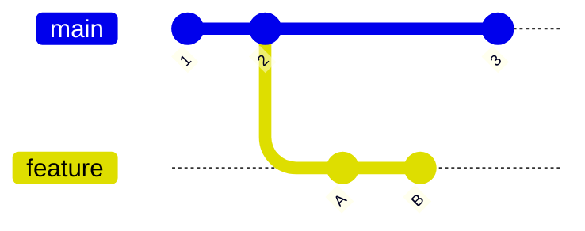

**【リベース後】**
（枝分かれの根元が `2` から `3` に付け替えられ、コミットも新しいものとして作り直されました）
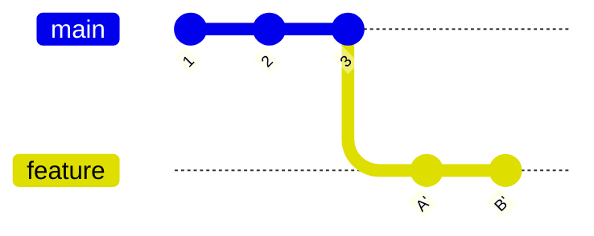

💡 **使い分けの例**:
基本的には「チームの開発内容を `main` に合流させる時は **Merge**（Pull Request経由）」「自分の作業途中のブランチに、他の人が更新した `main` の最新の変更を取り込む時は **Rebase**」というように使い分けるプロジェクトが多いです。

### GitとGitHubの全体像（モデル）

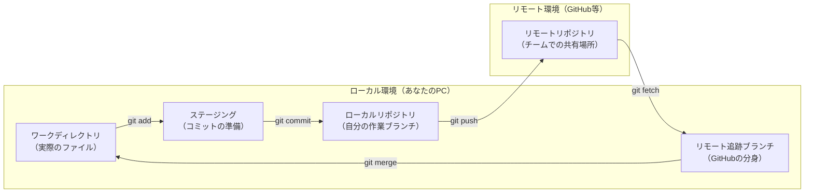

### 3.5 実践準備：リポジトリを作ろう

これ以降の「基本操作」を実際に手を動かして試せるよう、練習用のリポジトリを準備しましょう。
現場でよく使われる、以下の2つのパターンのどちらかでリポジトリを作成してください。

**パターンA: GitHub上で作成してcloneして始める方法（王道）**
初心者にとってもっともトラブルが少ない方法です。
1. https://github.com にアクセスし、ページ右上の「**+**」アイコンから「**New repository**」をクリックします。

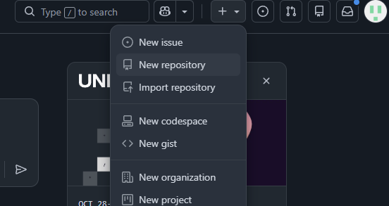

2. Repository name に `git-tutorial-demo` などの名前を入力します。
3. 今回は練習用なので、公開範囲は「**Private**」を選択しておきましょう。
4. 画面一番下の「**Create repository**」をクリックします。

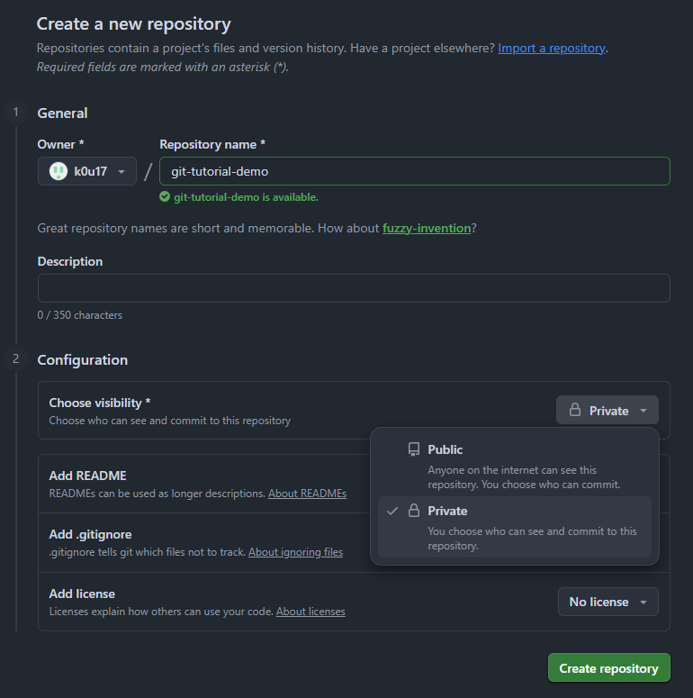

5. 作成されたページで「**SSH**」タブを選択し、表示されるURL（`git@github.com:あなたのユーザー名/git-tutorial-demo.git`）をコピーします。

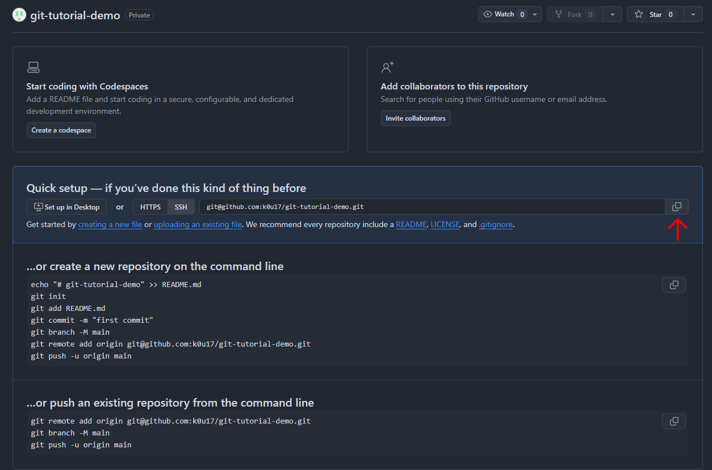

6. コピーしたURLを使って、以下のいずれかの方法で手元のPCにクローン（ダウンロード）します。
   * **GUIでの操作**: VS Codeを開き、**コマンドパレット**（`Ctrl + Shift + P` または `Cmd + Shift + P`）を開いて `Git: Clone` と入力・選択し、URLを貼り付けて実行します。保存先の親フォルダを聞かれるので任意の場所を選択します。
     
     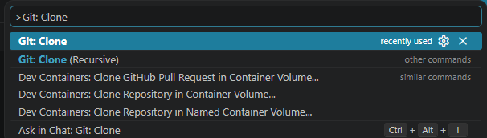
     
     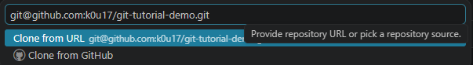
   
   * **CLIでの操作**: ターミナルを開き、ダウンロードしたい親フォルダ（例: ドキュメントフォルダなど）に移動してから以下のコマンドを実行します。
     ```bash
     git clone git@github.com:あなたのユーザー名/git-tutorial-demo.git
     ```
   💡 **クローン時のフォルダ生成について**:
   どちらの方法でも、指定した場所（またはターミナルで現在開いているディレクトリ）の中に、自動的にリポジトリ名（この場合は `git-tutorial-demo`）の**新しいフォルダが生成され**、その中にファイルがダウンロードされます。既存のフォルダの中身が直接上書きされるわけではありません。
7. クローンが完了したら、新しく生成された `git-tutorial-demo` フォルダをVS Codeで開きます。

**パターンB: ローカルで初期化して後からリモートを設定する方法**
手元に既にあるフォルダを後からGitHubにアップロードしたい場合によく使います。
1. ローカルPCの好きな場所に `git-tutorial-demo` というフォルダを作り、VS Codeで開きます。
2. 左側の「ソース管理」アイコン（丸が線でY字に繋がれたマーク）から「**Initialize Repository**（リポジトリを初期化する）」をクリックします（またはCLIで `git init` を実行）。

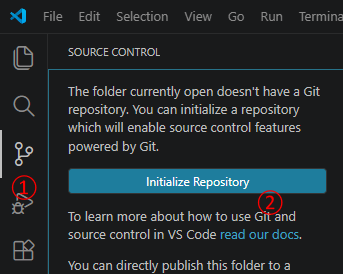

3. GitHub上でパターンAと同様に空のリポジトリを作成し、URLをコピーしておきます。
4. 以下のいずれかの方法で、ローカルリポジトリにリモートリポジトリを紐付けます（リモートの追加）。
   * **GUIでの操作**: ソース管理パネル上部の「**...**（その他のアクション）」をクリックし、「**リモート**」＞「**リモートの追加...**」を選択します。コピーしたURLを貼り付け、リモート名を聞かれたら `origin` と入力してEnterを押します。

   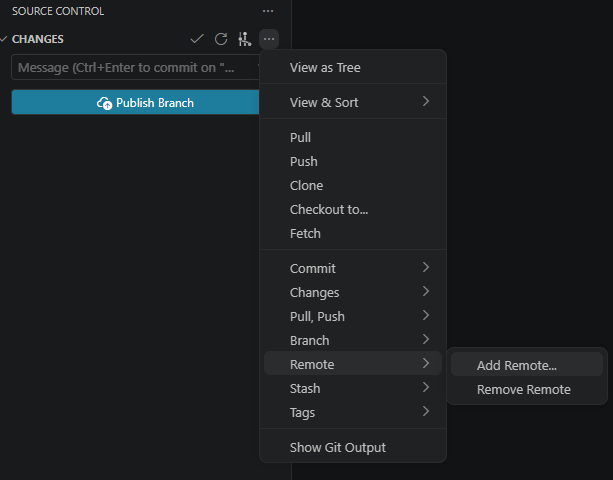

   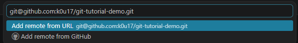

   * **CLIでの操作**: ターミナルで以下のコマンドを実行します。
     ```bash
     git remote add origin <コピーしたURL>
     ```

## 4. 基本操作

ここでは、VS Codeのソース管理（GUI機能）を使った直感的な操作方法と、ターミナル（CLI）を使ったコマンド操作の2つの方法を併記して解説します。
※CLIの操作は、VS Codeの統合ターミナル（`Ctrl + @` または `` Ctrl + ` `` で起動）やOSのターミナルを使用して実行します。

💡 **VS Codeの「ソース管理」画面の開き方**:
GUI操作の起点はすべて「ソース管理」パネルです。VS Codeの左端に縦に並んでいるアイコン群（アクティビティバー）から、**丸が線でY字に繋がれたようなアイコン**をクリックして開きます。
※ショートカット: `Ctrl + Shift + G` （Macの場合は `Cmd + Shift + G`）

### 4.1. ファイルをステージ（add）する
ファイルを編集するとGitによって「変更」として認識されます。これをコミット（記録）する準備として、「ステージングエリア」に移動させる操作です。

まずは準備した `git-tutorial-demo` リポジトリ内で、新しく `demo.txt` というファイルを作成し、中に `Hello, Git!` と入力して保存してみてください。これをステージ（add）してみましょう。

VS Codeの左側にある「ソース管理」アイコン（丸が線でY字に繋がれたマーク）を開きます。
保存したことで「変更（Changes）」エリアに `demo.txt` が現れるので、以下のいずれかの方法で追加（ステージ）します。

* **特定のファイルだけを追加する**:<br>
  * **GUI操作**: `demo.txt` にマウスを合わせ、右側に表示される「**+**」ボタンをクリックします。
    
    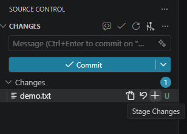
  
  * **CLI操作（ターミナル）**: または、以下のコマンドを実行します。
    ```bash
    git add <ファイル名>
    ```
    今回の例では以下のように入力して実行します。
    ```bash
    git add demo.txt
    ```

* **すべての変更を一括で追加する**:<br>
  * **GUI操作**: 複数ファイルがある場合、「変更（Changes）」という見出しの右側にある「**+**」ボタン（Stage All Changes）をクリックします。
    
    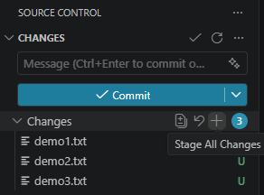
  
  * **CLI操作（ターミナル）**: または、以下のコマンドを実行します。
    ```bash
    git add .
    ```

💡 **ファイルの状態を確認するには**:
現在どのファイルがステージングエリアに追加されているか、または変更されているかを確認するには、以下の方法を使います。

* **GUIでの確認**:
  VS Codeの「ソース管理」エリアでは、ファイル名の右側にアルファベットのアイコンで表示されます。
  * **U (Untracked)**: まだGit管理（コミット履歴の追跡）に含まれていない「新規ファイル」です。
  * **A (Added)**: ステージングエリアに追加され、次のコミットに含まれる「新規ファイル」です。
  * **M (Modified)**: 既にGit管理されているファイルで、「変更が加えられた状態」です。
  
  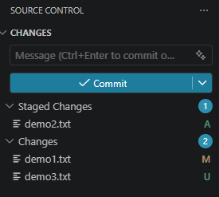

* **CLI（ターミナル）での確認**:
  ターミナルで以下のコマンドを実行することで、ファイルの状態をテキストで確認できます。
  ```bash
  git status
  ```
  出力
  ```text
  On branch main
  Your branch is up to date with 'origin/main'.

  Changes to be committed:
    (use "git restore --staged <file>..." to unstage)
          new file:   demo2.txt

  Changes not staged for commit:
    (use "git add <file>..." to update what will be committed)
    (use "git restore <file>..." to discard changes in working directory)
          modified:   demo1.txt

  Untracked files:
    (use "git add <file>..." to include in what will be committed)
          demo3.txt
  ```

### 4.2. コミット（commit）する
ステージングされた変更に対して、どんな変更を行ったかわかるメッセージをつけて、ローカルリポジトリに記録する操作です。

* **GUI操作**: ソース管理パネル上部にあるメッセージ入力欄に、今回の変更内容として `Add demo.txt` と入力し、「**Commit**」ボタンをクリックします。
  
  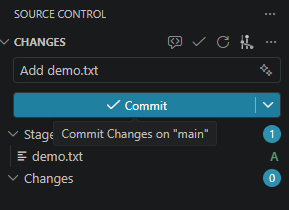

  ※メッセージを入力せずにコミットボタンを押すとエディタで`COMMIT_EDITMSG`というファイルが開かれます。そのファイルのコメントで案内されている通り、メッセージを入力してから右上のチェックボタン等を押すことでもコミットが行えます。
  
  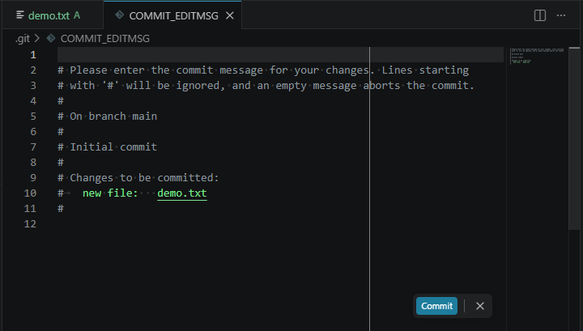

* **CLI操作（ターミナル）**: または、`-m` オプションの後にコミットメッセージを入力して実行します。
  ```bash
  git commit -m コミットメッセージ
  ```
  今回の例では、以下のように入力して実行します。
  ```bash
  git commit -m "Add demo.txt"
  ```
  ※ `-m` オプションを付けずに `git commit` だけを実行すると、ターミナル上でテキストエディタ（Vimなど）が立ち上がります。GUI操作でメッセージを入力せずにコミットボタンを押した時と同様に、裏側では `COMMIT_EDITMSG` という一時ファイルが開かれている状態です。そこにメッセージを入力・保存してエディタを終了することでコミットが行えます。

💡 **コミットのキャンセルについて**:
GUI・CLIどちらの場合でも、`COMMIT_EDITMSG` が開かれた際にメッセージを何も入力せず（または `#` で始まるコメント行のみの状態で）ファイルを閉じて終了すると、コミット操作をキャンセルすることができます。「間違えてコミットしようとしてしまった」という場合はこの方法で中断できます。

💡 **コミット履歴を確認するには**:
リモートへプッシュする前に、自分のコミットがローカルの履歴に正しく追加されたかを確認してみましょう。

* **GUIでの確認**:
  VS Codeの「ソース管理」ビュー内にある「**Graph**」セクションを開くと、コミット履歴が一覧表示されます。今作成したコミット（例: `Add demo.txt`）が一番上に追加されていることが確認できます。

  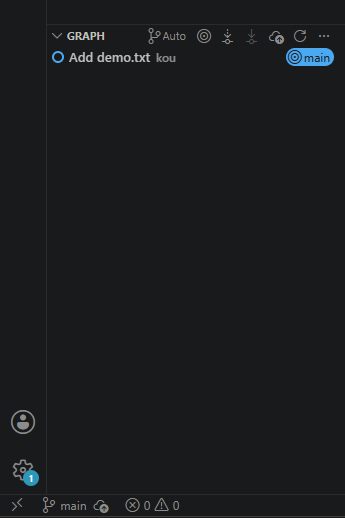

* **CLI（ターミナル）での確認**:
  以下のコマンドを実行すると、コミットの履歴が新しい順にテキストで表示されます。自分が入力したコミットメッセージが表示されているか確認してみましょう。
  ```bash
  git log
  ```
  出力
  ```
  commit xxxxxxxxxxxxxxxxxxxxxxxxxxxxxxxxxxxxxxxx (HEAD -> main)
   Author: kou <199738600+k0u17@users.noreply.github.com>
   Date:   Thu Jan 1 00:00:00 2026 +0900
    Add demo.txt
  ```
  （※履歴が長く画面に収まらない場合は、上下キーでスクロールし、`q` キーを押すと元の画面に戻れます）

### 4.3. プッシュ（push）する
コミット完了後、ローカルの変更履歴をGitHub（リモート）へ送信する操作です。ここまでのコミットをプッシュして、GitHubに反映させてみましょう。

* **GUI操作**: 
  * **上流ブランチが設定されていない場合**: 作成したばかりの空のリポジトリ（または新しく作成したブランチ）にプッシュする場合、「**Graph**」セクションのツールバーにあるアイコンが「**雲に上向き矢印のマーク（Publish Branch...）**」になっています。これをクリックすることでGitHub上にも対応するブランチが作成され、GitHubへプッシュが行われます。この際、上流ブランチとしてGitHub上に作成されたブランチが設定されます。

  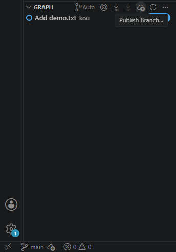

  * **既に上流ブランチが設定されている場合**: 既存の(空ではない)リポジトリをクローンした後や、1度プッシュ済みのブランチの場合、同じ場所のアイコンが「**上向き矢印のマーク（Push）**」になっています。これをクリックするだけで通常のプッシュが完了します。
    
    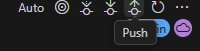

* **CLI操作（ターミナル）**: または、以下のコマンドを実行します。
  * **上流ブランチが設定されていない場合**: 以下のコマンドで、プッシュ先（上流）を設定しつつプッシュします（`-u` は `--set-upstream` の略です）。
    ```bash
    git push -u origin main
    ```
  * **既に上流ブランチが設定されている場合**: 既にプッシュ先が紐付けられているため、以下のコマンドのみでプッシュできます。
    ```bash
    git push
    ```

プッシュ完了後、ブラウザでGitHubのリポジトリページを更新し、`demo.txt` が無事にアップロードされていることを確認してください。

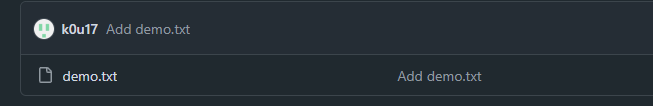

### 4.4. プル（pull）する

他の開発者がGitHubへアップロードした最新の変更を手元に取り込む（取得する）操作です。

> [!NOTE]
> **`git pull` の挙動（Fetch + Merge）**
> `git pull` は、一発でファイルを上書きしているわけではなく、第3章で学んだ以下の2つの処理を順番に実行するコマンドです。
> 1. **`git fetch`（データのダウンロード）**: まず、GitHub上にある最新の変更履歴をダウンロードし、「リモート追跡ブランチ（GitHubの分身）」を最新化します。この時点では、現在開いている作業ファイルは一切書き換わりません。
> 2. **`git merge`（自分の作業との合流）**: 次に、最新になった「リモート追跡ブランチ」のデータと、自分が手元で行っている作業を「合流（マージ）」させます。
> 
> いきなりファイルを上書きして作業内容を消してしまうことがないよう、「まずはFetchでダウンロードし、その後でMergeして安全に合流させる」という挙動になっていることを覚えておきましょう。

プルを体験するために、他の人が変更を加えた状況をシミュレートしましょう。
1. ブラウザのGitHub上で、先ほどプッシュした `demo.txt` を開き、右上の鉛筆アイコン（Edit this file）をクリックします。

  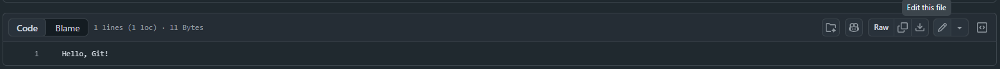

2. 文章を `Hello, Git! And GitHub!` のように変更したうえで、右上の「**Commit changes**」をクリックし、「Update demo.txt」と入力して、コミットを行います。

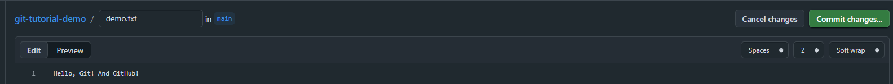

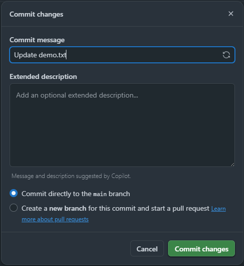

これでリモート（GitHub上）だけが先に進んだ状態になります。VS Codeに戻り、以下のいずれかの方法で**プル（pull）**を実行してみましょう。

* **GUI操作**: VS Codeの「ソース管理」ビュー内にある「**Graph**」セクションのツールバーから、**下向き矢印のマーク**（**Pull**）をクリックします。
  
  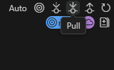

* **CLI操作（ターミナル）**: または、以下のコマンドを実行します。
  ```bash
  git pull
  ```

プルを実行後、ローカルの `demo.txt` を開いて中身が自動的に最新の文章に書き換わっていれば成功です！

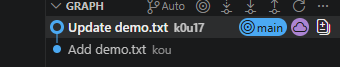

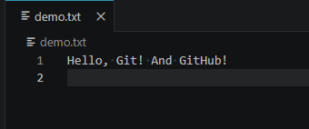


---

### 4.5. 不要なファイルを無視する（.gitignore）

プロジェクト内には、Gitで管理（共有）したくないファイルが必ず存在します。これらを指定するために、プロジェクトのルートディレクトリに `.gitignore` という名前のファイルを配置します。

実際に手を動かして、特定のファイルをGitから隠す（無視する）体験をしてみましょう。

1. **公開したくない内緒のファイルを作成する**
   VS Codeのエクスプローラーから `secret.txt` という新しいファイルを作成します。実際の開発では「公開してはいけないパスワードやAPIキー」などを想定しますが、今回は練習として以下のような「絶対に公開したくない秘密のテキスト」を書いて保存します。
   ```text
   Octocatはタコなのかネコなのかはっきりさせてほしい
   ```
2. **ソース管理ビューを確認する**
   保存すると、「ソース管理」ビューの「変更（Changes）」エリアに `secret.txt` が `U`（Untracked）として現れます。このままでは `git add .` をした時に一緒にコミット・プッシュされてしまい、本来公開すべきではない情報が世界中に公開されてしまう危険性があります！

3. **.gitignoreを作成する**
   これを防ぐため、新しく `.gitignore` という名前のファイルを作成し、中身に無視したいファイル名である `secret.txt` と書いて保存します。
   ```text
   secret.txt
   ```

4. **結果を確認する**
   `.gitignore` を保存した瞬間、「ソース管理」ビューから `secret.txt` が消え、VS Codeのエクスプローラー上でも `secret.txt` の文字が少し暗い色（グレーアウト）に変わったはずです。
   これで、今後どれだけ `git add .` を実行しても、`secret.txt` は絶対にGitの管理対象に入らなくなりました。（代わりに、無視設定を他の開発者と共有するために `.gitignore` ファイル自体が新しくソース管理に現れるので、これはコミットしてプッシュします）
   
   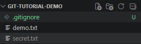

* **Git管理しないファイル例**:
  - パスワードやAPIキーが記述された設定ファイル（例: `.env`）
  - 自動生成されるビルド成果物（例: `dist/`, `build/`）
  - 外部からインストールしたライブラリ（例: `node_modules/`）
  - OS自動生成のシステムファイル（例: `.DS_Store`, `Thumbs.db`）
  - ワイルドカードを使った指定（例: `*.log`, `*.tmp`）

💡 **ベストプラクティス：**
* **.gitignoreの徹底**: APIキーなどの機密情報や環境変数（`.env`）は絶対にコミットせず、最初に `.gitignore` に指定します。一度Gitにコミットしてしまうと、後から `.gitignore` に追加しても履歴には残ってしまうため注意が必要です。
* **こまめなコミットとプッシュ**: 作業中のコードがローカル環境のトラブルで失われないよう、区切りの良いところでこまめにコミットし、リモートリポジトリにプッシュしておきます。


## 5. GitHubを用いた共同編集

GitHubを使うことで、複数人でのプログラム開発を円滑に行うことができます。

* **プルリクエスト (Pull Request / PR)**: 自分が加えた変更を、他の開発者にレビューしてもらい、本番コード（`main` ブランチなど）へ取り込んでもらう（マージする）ように依頼する機能です。
* **コードレビュー (Code Review)**: プルリクエストされた変更に対して、バグがないか、設計に問題がないかを他の開発者がチェックし、必要に応じて修正のコメントを出すプロセスです。
* **イシュー (Issue)**: バグの報告や機能追加や要望など、プロジェクトの課題やToDoを管理するスレッド機能です。

### プルリクエスト（PR）を通じた共同開発の流れ

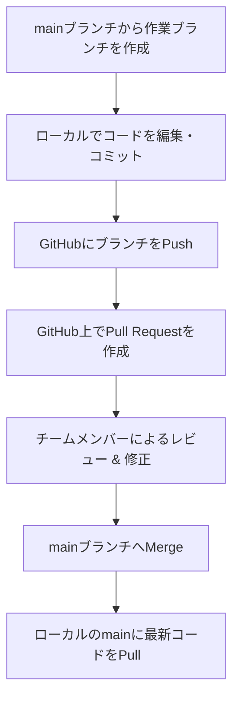

### コンフリクト（競合）が発生する仕組みと解決

マージする際、合流しようとしている2つのブランチで、同じファイルの同じ箇所がそれぞれ異なる内容に変更されていた場合、Gitはどちらを優先すべきか自動で判断できず、**コンフリクト（競合）**が発生します。

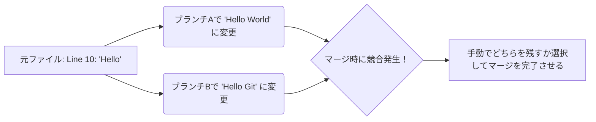

💡 **コンフリクトに遭遇しやすい典型的なシチュエーション**
コンフリクトは「ブランチの合流」というGitの仕組み上、以下のような場面でよく発生します。
* **チーム開発での合流時**: 自分が作業している間に、他のメンバーが同じファイルの同じ箇所を修正して先に `main` へマージしてしまった場合。（その後、自分が最新の `main` を `pull` したり、自分のPull Requestをマージしようとした時に発覚します）
* **長期間のブランチ作業**: 1つのブランチで何日も作業している間に `main` 側が大きく更新され、最新の `main` を自分の作業ブランチに取り込もう（Merge / Rebase）とした場合。
* **自分ひとりの開発**: 「実験A」と「実験B」という2つのローカルブランチを行き来しながら同じファイルを修正し、最終的に両方の変更を1つに合流させようとした場合。

### 5.1. プルリクエスト（PR）の具体的な作成手順

ここまでの内容を使って、実際にPull Requestを作ってマージするまでを体験してみましょう。

1. **作業ブランチの作成と変更のコミット**
   まず、作業用の新しいブランチを作成します。VS Codeで左下のブランチ名（`main`）をクリックし、「**+ 新しいブランチの作成**」から `feature/update-demo` というブランチを作成します。

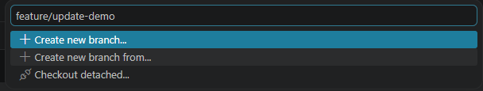

   その後、`demo.txt` に2行目として `This is a test for Pull Request.` と追記して保存し、add と commit（メッセージ: `Update demo.txt`）を行います。

2. **ブランチのプッシュと比較（Compare）**
   コミットできたら「**Publish Branch**」（またはPush）をしてGitHubへ送信します。
   送信後、ブラウザでGitHubのリポジトリページを開くと、「**Compare & pull request**」という黄色いボタンが出現するので、それをクリックします。
   
   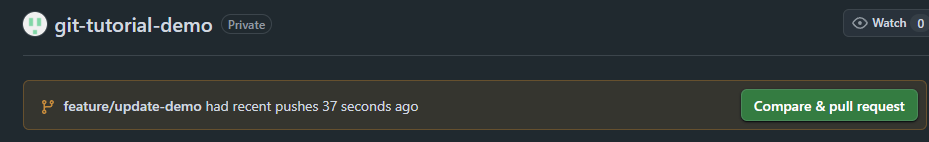

3. **PRの詳細入力と作成**
   PRのタイトルと、具体的に何を変更したかの詳細を記入し、「**Create pull request**」ボタンをクリックします。
   
   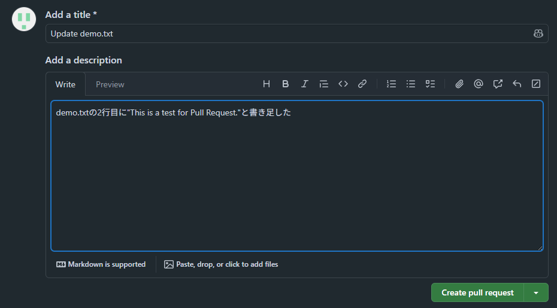

4. **コードレビューと修正**
   通常は、作成されたPull Requestの画面上で、チームメンバー（レビュアー）が変更内容を確認し、コメントや修正の指摘（レビュー）を行います。今回は練習なので、以下の手順で自分自身でレビューの流れを体験してみましょう。
   * 「**Files changed**」タブを開き、緑（追加）や赤（削除）でハイライトされたコードの差分を確認します。
   * 行番号の横にカーソルを合わせると現れる `+` ボタンをクリックすると、その行に対して具体的な指摘コメントを残すことができます。

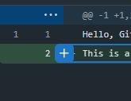

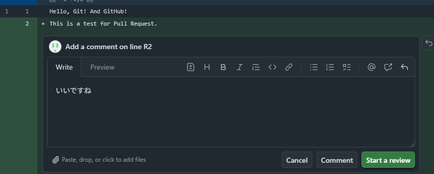

   * 確認が終わったら、右上の「**Submit Review**」ボタンから、Comment/Approve/Request Changesのいずれかを選択してレビューを完了します。
   
   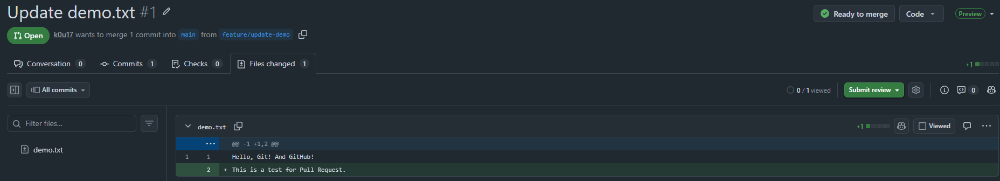

5. **マージの実行**
   問題なければ、「**Merge pull request**」ボタンをクリックして `main` ブランチに変更を取り込みましょう！
   
  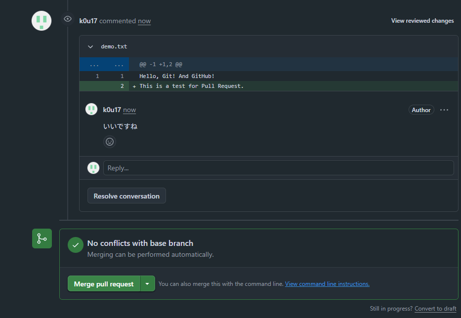

---

### 5.2. イシュー（Issue）の作成手順

開発中のバグや、これから追加したい機能（ToDoリスト）を登録して管理します。

1. **新しいIssueを作成**
   リポジトリ上部の「**Issues**」タブを開き、「**New Issue**」をクリックして、問題のタイトルと具体的な発生手順や環境を記入します。
   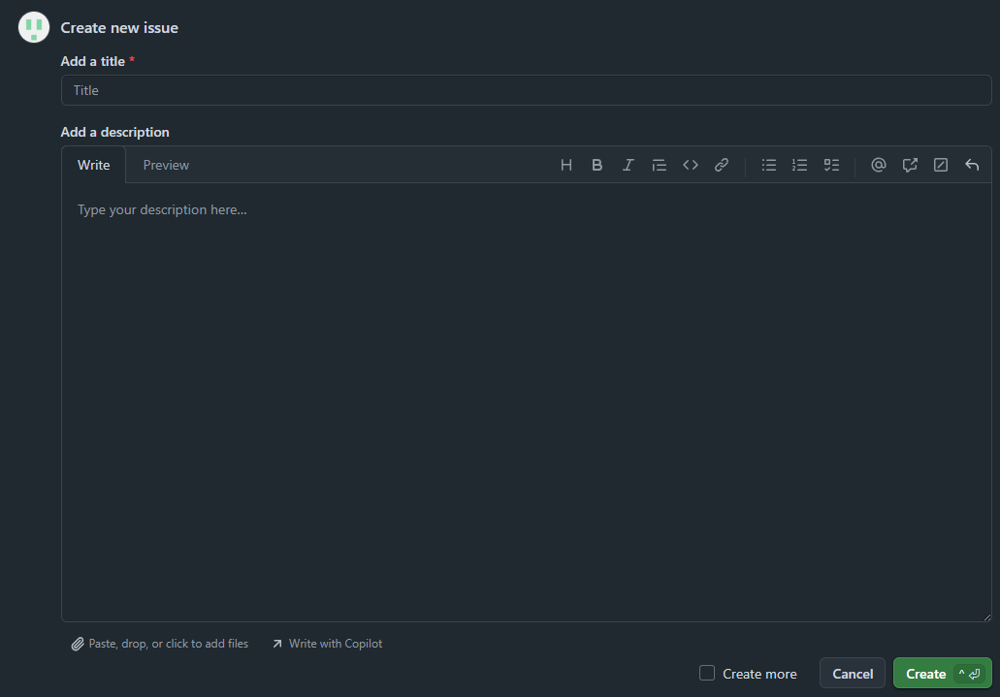

💡 **ベストプラクティス：**
* **プルリクエストは小さく作成する**: 1つのPRに多くの変更を詰め込みすぎると、コードレビューの負担が増え、マージの遅延やバグの見落としにつながります。変更は小さく（一般的に数百行以内）保つのが理想です。
* **マージ前にローカルを最新に保つ**: 共同開発中、自分の作業と並行して他の人が `main` に変更を加えていることがあります。PRをマージする前に、一度最新の `main` を自分の作業ブランチにマージ（またはリベース）し、ローカルでコンフリクトがないこと・正しく動くことを確認します。

---

## 6. さらにステップアップするために

ここまでの内容で、GitとGitHubの基本操作は完璧にマスターできました！
しかし実際の開発では、「ブランチをマージ（合流）する際に、同じ箇所の変更がぶつかってしまった時の対応（コンフリクト）」や、「ゴチャゴチャになったコミット履歴を綺麗に整理する操作（rebase）」などが必要になる場面があります。

これらについてさらに実践的なスキルを身につけたい場合は、以下の参考記事が非常にわかりやすくまとまっているのでおすすめです。

* **コンフリクト（競合）の解消方法**
  [VSCodeによるGitコンフリクト解消](https://zenn.dev/ikejiri/articles/f10fa96d9a5650)
* **コミットの整理（Rebase / Squash）**
  [VSCodeでgit rebaseを使ってコミットをまとめる](https://qiita.com/tz77/items/cb6841d0f7ea591a0bfb)

まずは基本の `add` → `commit` → `push` → `pull` のサイクルにしっかり慣れ、現場で必要になったタイミングでぜひこれらの高度な操作にも挑戦してみてください！
